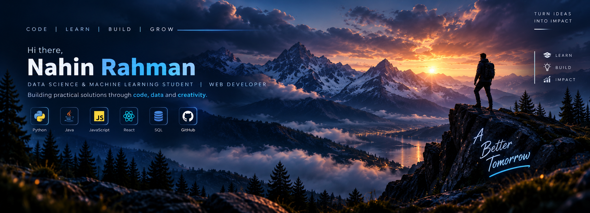

  

<h2>👨‍💻 About Me</h2>

I'm Nahin Rahman, a B.Tech student specializing in Data Science and
Machine Learning, with a strong interest in Web Development and
Software Engineering.

I enjoy building practical projects, exploring new technologies,
and turning ideas into working applications.

---

<h2>🚀 What I'm Doing</h2>

<ul>
  <li>🎓 Pursuing B.Tech in Data Science & Machine Learning</li>
  <li>💻 Building Web & Full-Stack Applications</li>
  <li>📊 Exploring Data Science & Machine Learning</li>
  <li>⚙️ Learning DevOps, Cloud & Modern Development Practices</li>
  <li>🌱 Continuously improving my programming and problem-solving skills</li>
</ul>

---

<h2>🛠️ Tech Stack</h2>

<h3>Languages</h3>

  
  
  
  

<h3>Web Development</h3>

  
  
  
  
  

<h3>Data & Database</h3>

  
  
  
  
  

<h3>Tools & Technologies</h3>

  
  
  
  

---

<h2>🔥 Featured Projects</h2>

<h3>🛡️ Security Vulnerability Detection Framework</h3>

A Python-based security framework designed to simulate, detect and
analyze security vulnerabilities through a structured testing workflow.

<a href="https://github.com/Nahinrahman03/Security-Vulnerability-Detection-Framework">
View Repository →
</a>

<h3>📰 The Fourth Pillar</h3>

A modern news platform delivering concise five-point summaries with
a structured moderation workflow.

<a href="https://github.com/Nahinrahman03/the-fourth-pillar">
View Repository →
</a>

<h3>🎵 Music Mini Player Simulation</h3>

A Java-based music player simulation demonstrating core playback and
player-management functionality.

<a href="https://github.com/Nahinrahman03/Music-Mini-Player-Simulation">
View Repository →
</a>

---

<h2>📊 GitHub Stats</h2>

  
  

---

<h2>🔥 Contribution Streak</h2>

  

---

<h2>🌱 Currently Learning</h2>

Python • Data Science • Machine Learning • React • Next.js • SQL • DevOps

---

<h2>🤝 Connect With Me</h2>

  

  

  

## 💡 Developer Mindset

> "Build something useful. Learn something new. Repeat."

---

  <i>“Code today. A better tomorrow.”</i>

